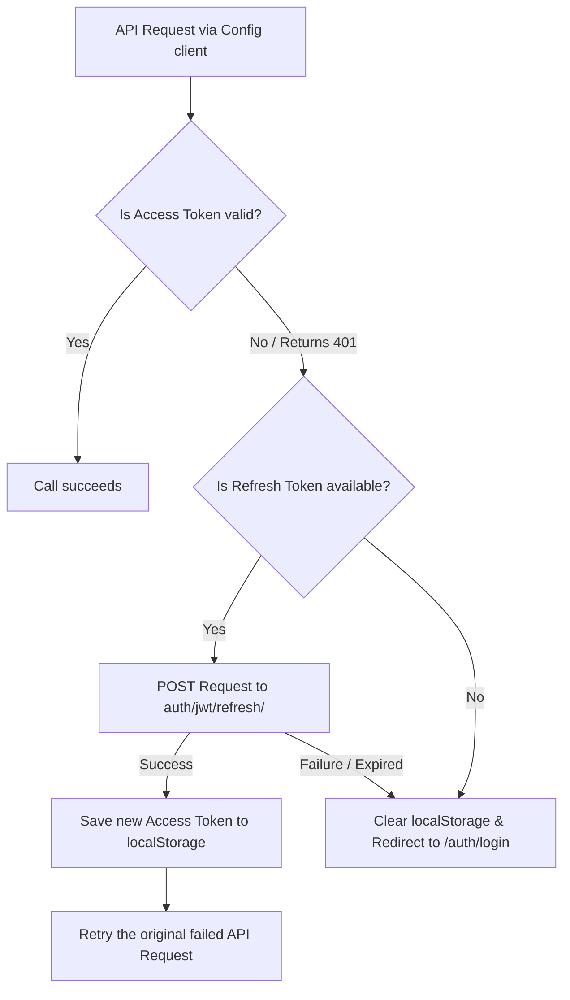

# FreeQueues Frontend Documentation

Welcome to the **FreeQueues** Frontend Technical Documentation. This document provides a comprehensive overview of the design, architecture, structure, and implementation details of the FreeQueues web application.

---

## 📖 1. Overview & Objectives

**FreeQueues** is an intelligent queue management platform designed to eliminate waiting lines. It allows:
- **Customers** to browse businesses, branches, view real-time queue statuses, join queues remotely from their phones, and receive estimated wait time updates.
- **Businesses** to manage multiple branches, counters (service points), staff assignments, real-time queues, and view operational metrics.

The frontend is a modern Single Page Application (SPA) designed to be highly responsive, real-time, lightweight, and accessible across mobile, tablet, and desktop screens. It supports dark mode, is fully localized in three languages (French, English, Arabic) with RTL layout handling, and integrates with a Django REST Framework (DRF) backend.

---

## 🛠️ 2. Architecture & Technology Stack

The application is built on top of a highly optimized React development stack:

| Technology / Library | Description |
| :--- | :--- |
| **Vite** (v7.x) | Modern, lightning-fast build tool and dev server providing hot module replacement (HMR). |
| **React** (v19.x) | Component-based user interface library. |
| **Tailwind CSS** (v4.x) | Utility-first CSS framework integrated via `@tailwindcss/vite` for swift development and rich styling. |
| **React Router DOM** (v7.x) | Client-side routing engine supporting nested paths, layouts, and route definitions. |
| **Axios** | HTTP client for interfacing with RESTful APIs, with custom interceptors for token management. |
| **Motion (Framer Motion)** | Animation engine used for smooth transitions, spring physics, and rich micro-animations. |
| **React Hot Toast** | Toast notifications to provide sleek visual feedback for API actions. |
| **React Icons** | Premium vector icon packs (React Icons library, including FontAwesome and Ionicons). |
| **React Modal** | Accessible modal library customized with Motion animations. |

---

## 📁 3. Project Directory Structure

The frontend application follows a clean, modular structure centered within the `src/` folder:

```
frontend/
├── public/                 # Static assets (favicons, logos)
├── src/
│   ├── assets/             # Images, SVGs, static assets
│   ├── component/          # Reusable components
│   │   ├── common/         # Core UI building blocks (Button, Input, Modal)
│   │   ├── layout/         # Shell containers (NavBar, Sidebar, Footer, MainLayout)
│   │   └── ui/             # Contextual UI components (Hero, Cards, Loading spinners)
│   ├── config/             # Environment variables and constants
│   │   ├── constants.js    # Globally shared constants
│   │   └── environment.js  # API base URL configuration (VITE_BASE_URL)
│   ├── context/            # React Contexts for global state
│   │   ├── AuthContext.jsx # User credentials and token storage
│   │   ├── ThemeContext.jsx# Dark/light mode switcher
│   │   └── LanguageContext.jsx # Multi-lingual state and translations
│   ├── features/           # Feature-specific modules (Auth forms, Dashboard cards)
│   │   ├── Auth/           # LoginForm, RegisterForm, ResetPassword
│   │   ├── Dashboard/      # Live Dashboard elements
│   │   └── Profile/        # Profile update form
│   ├── hooks/              # Custom reusable React hooks
│   │   ├── useAuth.js      # Syntactic sugar for useAuth context consumption
│   │   ├── useLocalStorage.js # Local storage state synchronization hook
│   │   └── useMediaQuery.js  # Responsiveness breakpoint hook
│   ├── pages/              # Routing entry points / Page-level views
│   │   ├── auth/           # Authentication pages (Login, Register, Activation)
│   │   ├── core/           # Subdomain/space management (Company, Agency, DashboardPage)
│   │   ├── index.js        # Global page exporter
│   │   └── Home.jsx, About.jsx, Pricing.jsx, Settings.jsx, etc.
│   ├── routes/             # App routing definitions
│   │   ├── loggedRoutes.jsx# Links rendered in the authenticated user sidebar
│   │   ├── router.jsx      # Browser routing definition tree
│   │   └── routes.jsx      # String definitions of all frontend routes
│   ├── services/           # API interaction and backend networking layer
│   │   ├── api/            # Individual endpoints (authService, userService, etc.)
│   │   └── config/         # Custom Axios instances (Config, authConfig)
│   ├── style/              # Global custom stylesheets
│   ├── utils/              # Utility helpers
│   │   ├── translations.jsx # Multi-lingual key dictionary (EN, FR, AR)
│   │   └── validators.jsx  # Input field validators
│   ├── App.css             # Main styling extensions
│   ├── App.jsx             # Top-level routing router provider
│   ├── index.css           # Tailwind v4 import entrypoint
│   └── main.jsx            # Application mount point with providers nested
├── eslint.config.js        # Linting rules
├── index.html              # Core HTML structure
├── package.json            # Scripts, dependencies, and devDependencies
└── vite.config.js          # Vite configuration with path aliases (@)
```

---

## 🗺️ 4. Routing & Layout Architecture

Routing is managed in `src/routes/` and defined inside a central tree using React Router DOM's `createBrowserRouter`.

### 📂 Nested Routes Structure (`src/routes/router.jsx`)

1. **`MainLayout` (Unauthenticated/Public Shell)**
   - Wraps general website visitors.
   - Contains a standard header (`NavBar`) and footer (`Footer`) surrounding page content.
   - **Routes**:
     - `/` (Home page)
     - `/about` (About page)
     - `/contact` (Contact form)
     - `/pricing` (Subscription plans)
     - `/trust-center` (Security and trust compliance)
     - `/privacy` (Privacy policy)
     - `/cookies` (Cookie notice)
     - `/abuse` (Report abuse)
     - `/auth/login` (User login form)
     - `/auth/register` (User registration form)
     - `/auth/activate` (Account activation verification)
     - `/auth/forget-password` (Request password reset link)
     - `/auth/reset-password` (Configure new password)

2. **`SideBar` Layout (Authenticated Space Shell)**
   - Mounted as a child of the main layout under the `/space` path prefix.
   - Provides a premium sidebar panel mapping user-accessible pages with navigation links and actions.
   - **Dynamic Routes (Space-Specific)**:
     - `:space/company` (Company overview)
     - `:space/agency` (Agency and counter managers)
     - `:space/dashboard` (Live queue operations dashboard)
     - `:space/settings` (Personal and corporate configurations)

---

## 🌍 5. Global State & Context Providers

The application state is managed cleanly using React Contexts, nested at the root of the app (`main.jsx`):

### 🌐 A. `LanguageProvider` (`src/context/LanguageContext.jsx`)
- **Base Default Language**: French (`fr`). English (`en`) and Arabic (`ar`) are also fully supported.
- **RTL Support**: When Arabic (`ar`) is enabled, it automatically updates the HTML document direction (`dir="rtl"`), altering the design system layout direction across all pages.
- **Translation Strategy**: Implements client-side dictionary lookups mapped in `src/utils/translations.jsx`.
```javascript
const { lang, t, changeLang } = useLang();
// Outputting local strings:
<h1>{t("aboutTitle")}</h1>
```

### 🌙 B. `ThemeProvider` (`src/context/ThemeContext.jsx`)
- Manages switching between dark and light modes.
- Synchronizes the current active theme into standard local storage (`freequeuesTheme`).
- Controls high-contrast styling adjustments by toggling the `"dark"` class on the root `document.documentElement` element to trigger Tailwind's dark utility variations seamlessly.

### 🔐 C. `AuthProvider` (`src/context/AuthContext.jsx`)
- Coordinates current logged-in user profiles.
- Pulls user records on initialization by verifying local storage access tokens.
- Exposes `login(tokens)`, `logout()`, and loading states to ensure UI synchronization.

---

## ⚡ 6. Network Layer & REST API Client

The application communicates with the backend REST API via two separate **Axios** instances designed in `src/services/config/`:

### 📂 Unauthenticated Client (`authConfig.jsx`)
- Used for operations that do not require an active JWT session.
- Exposes pathways such as registration, logging in, requesting password resets, and account activation.

### 📂 Authenticated Client (`Config.jsx`)
- Implements headers injection to load the user's active session (`Authorization: Bearer <token>`).
- Implements robust interceptors to perform silent automatic token refreshes in the background:

#### 🔄 Token Auto-Refresh Workflow:


### 📡 Available Endpoint Services (`src/services/api/`)
- **`authService.jsx`**: Handles `/auth/users/`, `/auth/jwt/create/`, activations, password resets, and logging out.
- **`userService.jsx`**: Manages current user profiles (`/auth/users/me/`).
- **`commonService.jsx`**: Manages shared static data actions (e.g. contact forms support).
- **`branchService.jsx`**, **`companyService.jsx`**, **`paymentService.jsx`**: Feature-specific backend APIs.

---

## 🎨 7. Reusable Component Catalog

All components are engineered with strict visual aesthetics, accessibility, and robust styling using Tailwind CSS v4 variables:

### 🧩 Common Components (`src/component/common/`)

#### 🔘 1. `Button.jsx`
- Customized buttons with clean focus indicators, customizable sizes (`sm`, `md`, `lg`), and visually attractive variants.
- **API Parameters**:
  - `variant`: `"primary"` (default blue-600), `"secondary"` (light gray-200), `"danger"` (red-600), or `"outline"` (border outline).
  - `size`: `"sm"`, `"md"`, `"lg"`.
  - `fullWidth`: Boolean value expanding the button to occupy its parent container.
  - `disabled`: Handles states like loading animations with custom hover overrides.

#### 📝 2. `Input.jsx`
- Premium input form field with automated label references and inline field error prompts.
- **Password Visibility Mode**: For fields of type `"password"`, it renders a high-fidelity visual eye toggle (`FaEye` / `FaEyeSlash`) to show and hide character sequences safely.

#### 🔲 3. `Modal.jsx`
- Fully customized popovers built on top of `react-modal`.
- Equipped with **Framer Motion spring physics** (`AnimatePresence`, `Motion.div`) to create premium, smooth entrance and exit transitions when opened or closed.
- Integrates standard backdrop blurs (`backdrop-blur-sm`) and accessible escape-key configurations.

### 🖼️ UI Components (`src/component/ui/`)
- **`Hero.jsx`**: Landing section for the home view with responsive visuals and custom animations.
- **`Services.jsx`**: Modular cards grid highlighting the platform features.
- **`Card.jsx`**: Styled glassmorphic container with custom shadows.
- **`LoadingSpinner.jsx`**: Sleek custom spinner overlays.
- **`ErrorDisplay.jsx`**: Renders standard inline alert boxes for errors.

---

## 🚀 8. Build & Development Workflow

### 📋 Prerequisites
Ensure you have **Node.js** (v18 or higher) and **npm** installed.

### 💻 Developer Command Reference
Inside the `/frontend` directory:

```bash
# 1. Install project dependencies
npm install

# 2. Run the Vite development server (port 5173 by default)
npm run dev

# 3. Compile and bundle the application for production deployment
npm run build

# 4. Review code quality and find lint issues via ESLint
npm run lint

# 5. Spin up a local server to preview the compiled production bundle
npm run preview
```

---

## 🎨 9. Design System & Aesthetics Guidelines

The design uses best practices in modern web development:
1. **Glassmorphism & Shadows**: Light backdrop blurs (`backdrop-blur-sm`), custom borders (`border-gray-100 dark:border-gray-700`), and subtle drop shadows (`shadow-xl`) ensure a premium, modern feel.
2. **Color Palette**: Curated primary color tokens (sleek Indigo/Blue `bg-blue-600` and dark-mode slate `bg-gray-800` / `bg-gray-900`) instead of browser defaults.
3. **Smooth Transitions**: Micro-interactions are handled via Framer Motion (`spring` transitions with a `bounce` of `0.3`) and Tailwind transition utilities (`transition-colors duration-200`).
4. **Localization Alignment**: Always ensure layouts handle both LTR and RTL correctly. Use responsive layout grids (`grid grid-cols-1 md:grid-cols-3`) to allow flexible space adjustments.
